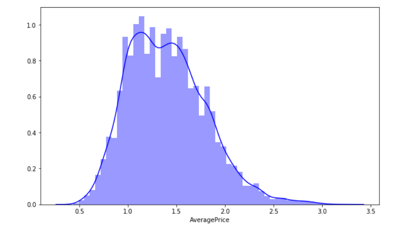

# Predict-Future-Prices-Using-Facebook-Prophet
To predict the future price of a product based on the previous year data and to train the model according to that data using the facebook prophet tool. Click [Here](avocado.csv) to view the dataset.

    This graph represents the plot distribution of average price of the product. 

    The above bar graph indicates the count or unit of product sold in each year. 

    The above graph shows the previous data distribution along with the future price prediction indicated by the blue area. 

    The above graph shows the previous data distribution of a given area (here Chicago) along with the future price prediction indicated by the blue area. 

    The top graph shows the trend of the data, i.e., trend of the price of an avocado over the different years. The bottom graph shows the variation of price and the future predicted price based on the monthly distribution. 

